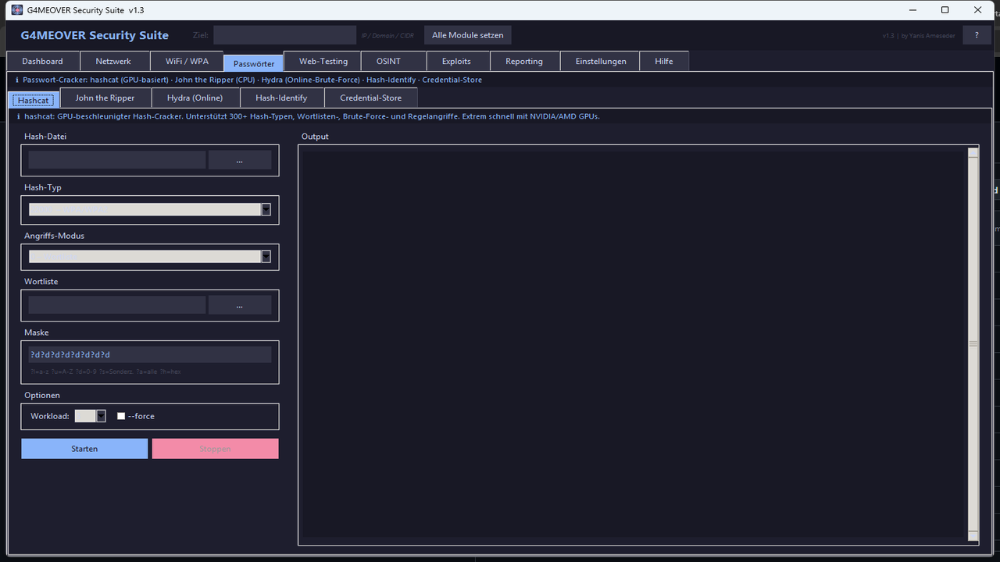
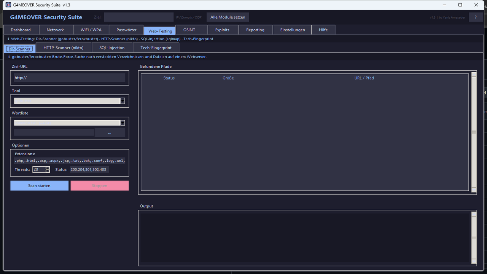
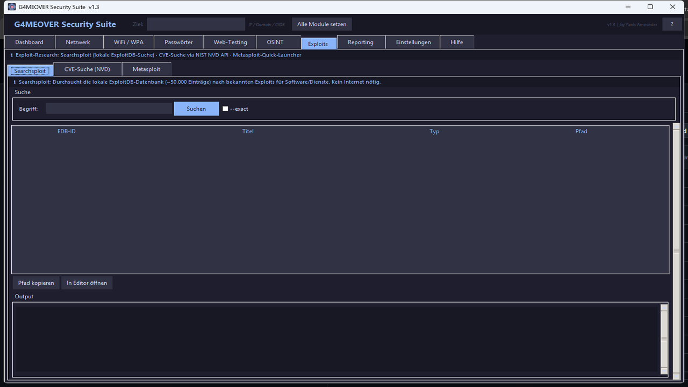
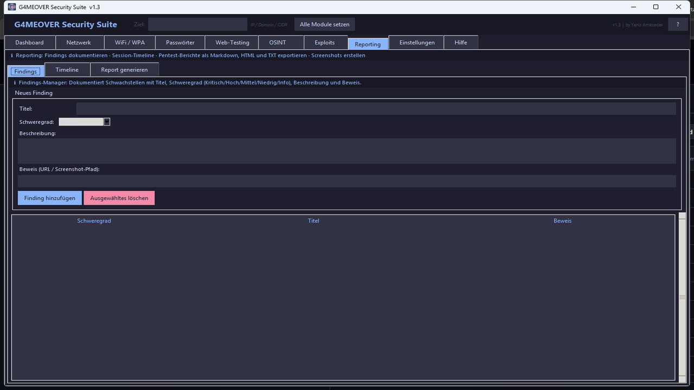
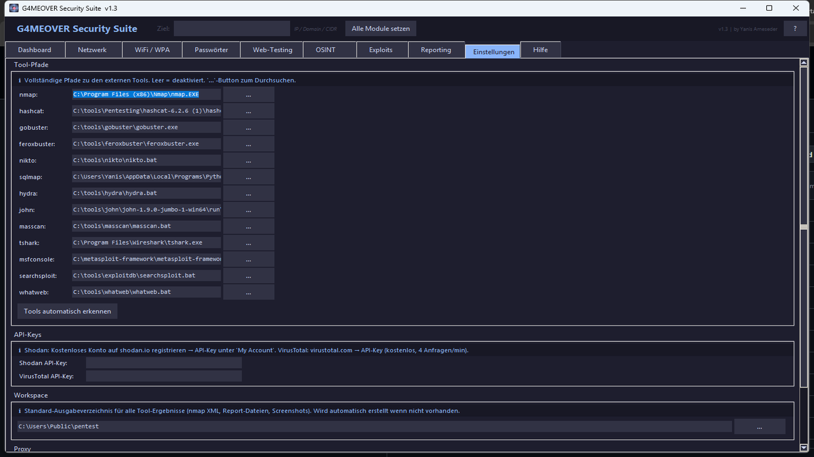
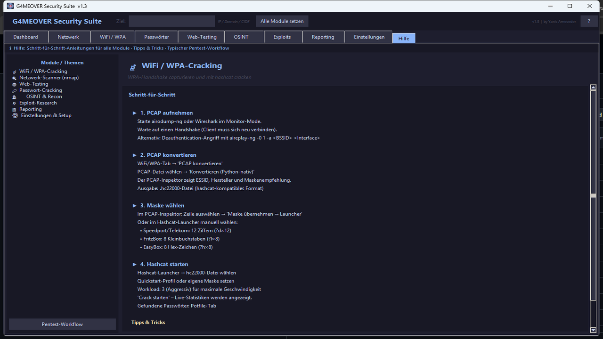

<div align="center">

# G4MEOVER Security Suite

**All-in-One Pentesting-GUI für Windows · Python 3.12 · Catppuccin Mocha**

[](https://github.com/G4MEOVER18/g4meover-security-suite/releases)
[](https://python.org)
[](.)
[](LICENSE)
[](https://github.com/G4MEOVER18/g4meover-security-suite/stargazers)

*Entwickelt von **Yanis Ameseder***

</div>

---

Die **G4MEOVER Security Suite** vereint 13+ Sicherheitstools unter einer einheitlichen, dunklen Oberfläche im **Catppuccin Mocha**-Design. Entwickelt als persönliches Pentesting-Arsenal für Windows – von der Reconnaissance bis zum Report, alles in einem Fenster.

---

## Screenshots

### Dashboard – Übersicht & Tool-Status

*Farbige Tool-Status-Badges, Activity-Log, Quickstart-Buttons und globale Ziel-Eingabe im Header.*

---

### Netzwerk-Scanner

*nmap mit 7 vorkonfigurierten Scan-Profilen (Quick, Stealth, Full, Vuln...) + Masscan Quick-Sweep. Ergebnisse im farbkodierten Treeview, Export als JSON/TXT.*

---

### WiFi / WPA-Cracking

*PCAP → hc22000-Konvertierung (Streaming, auch für große Captures), PCAP-Inspektor mit BSSID/OUI-Lookup (online via macvendors.com), Hashcat-Launcher mit Live-Statistiken und Potfile-Viewer.*

---

### PMKID-Sniffer

*Extrahiert PMKIDs aus bestehenden PCAP-Dateien oder per Live-Capture (tshark). Direkte Übergabe an hashcat -m 22000. Kein WPA-Handshake erforderlich.*

---

### Passwort-Cracker

*Hashcat (GPU, alle Modi), John the Ripper und Hydra (Online-Brute-Force: SSH, FTP, HTTP, RDP, SMB...) in einem Tab. Gefundene Credentials werden grün hervorgehoben.*

---

### Web-Testing

*Directory-Bruteforce mit gobuster/feroxbuster (Status-Code-Farben), nikto HTTP-Scanner, SQLMap-Wrapper und Tech-Fingerprinting (WhatWeb: CMS, Framework, Server, WAF).*

---

### OSINT

*WhoIs, DNS-Lookup (A/MX/TXT/NS), Subdomain-Enumeration via crt.sh, IP-Geolokation, Shodan-Integration, Reverse-IP und OUI/BSSID-Hersteller-Lookup.*

---

### Exploits & CVE-Recherche

*SearchSploit-Wrapper (47.000+ ExploitDB-Einträge, kein Ruby nötig), NIST NVD CVE-Suche mit CVSS-Score-Badge und optionaler Metasploit-Launcher.*

---

### Reporting

*Findings-Manager (Kritisch/Hoch/Mittel/Niedrig/Info), Session-Timeline aller Tool-Ausführungen, automatischer Report-Generator (Markdown, HTML, TXT).*

---

### Einstellungen

*Tool-Pfade für alle 13 Tools, API-Keys (Shodan, VirusTotal), Workspace-Verzeichnis, Proxy-Einstellungen und automatische Tool-Erkennung.*

---

### Hilfe-System

*Interaktive Schritt-für-Schritt-Anleitungen für jedes Modul mit Tipps, Befehlsbeispielen und vollständigem Pentest-Workflow.*

---

## Funktionen im Überblick

| Tab | Enthaltene Tools | Funktion |
|-----|-----------------|----------|
| **Dashboard** | — | Tool-Status, Activity-Log, Quickstart-Buttons |
| **Netzwerk** | nmap, masscan | Host-Discovery, Port-Scan, OS-Erkennung |
| **WiFi / WPA** | hashcat, tshark | PCAP-Konvertierung, WPA-Cracking, BSSID-Lookup |
| **PMKID** | tshark, hashcat | PMKID-Extraktion aus PCAP, Live-Sniffing |
| **Passwörter** | hashcat, john, hydra | Hash-Cracking (GPU), Online-Brute-Force |
| **Web-Testing** | gobuster, feroxbuster, nikto, sqlmap, whatweb | Dir-Scan, HTTP-Audit, SQL-Injection, Fingerprinting |
| **OSINT** | — | WhoIs, DNS, Subdomain-Enum, Shodan, Geo-IP |
| **Exploits** | searchsploit, metasploit | CVE-Suche, ExploitDB, MSF-Launcher |
| **Reporting** | — | Findings, Markdown-/HTML-Report |
| **Einstellungen** | — | Pfade, API-Keys, Proxy |
| **Hilfe** | — | Schritt-für-Schritt-Guides |

---

## Installation

### Voraussetzungen

- **Python 3.12+** (inkl. tkinter)
- **Windows 10/11**

```bash
git clone https://github.com/G4MEOVER18/g4meover-security-suite.git
cd g4meover-security-suite
python openclaw_suite.py
```

### Optionale externe Tools (werden automatisch erkannt)

| Tool | Download | Funktion |
|------|----------|----------|
| nmap | [nmap.org](https://nmap.org/download.html) | Port-Scanner |
| hashcat | [hashcat.net](https://hashcat.net/hashcat/) | GPU Hash-Cracker |
| gobuster | [GitHub](https://github.com/OJ/gobuster/releases) | Dir-Bruteforce |
| feroxbuster | [GitHub](https://github.com/epi052/feroxbuster/releases) | Dir-Bruteforce rekursiv |
| nikto | [GitHub](https://github.com/sullo/nikto) | Web-Scanner |
| sqlmap | [sqlmap.org](https://sqlmap.org/) | SQL-Injection |
| john | [openwall.com](https://www.openwall.com/john/) | Password Cracker |
| tshark | [Wireshark](https://www.wireshark.org/download.html) | Paket-Analyse |
| metasploit | [metasploit.com](https://www.metasploit.com/download) | Exploit-Framework |

Python-Alternativen für hydra, masscan und whatweb sind bereits enthalten – kein separater Download nötig.

---

## EXE bauen

Eigene `.exe` mit Icon und Versions-Info erstellen:

```batch
# 1. Icon einfügen (optional)
copy mein-logo.ico assets\g4meover.ico

# 2. EXE bauen
build_exe.bat
```

Die fertige EXE liegt dann unter `dist\G4MEOVER_Suite.exe` (~12 MB, kein Konsolenfenster).

---

## KI-Integration (AI-Core API)

Ein leichtgewichtiger HTTP-Server stellt die Suite-Funktionen für KI-Systeme bereit:

```bash
python pentest_api_server.py
# Läuft auf http://0.0.0.0:18800
```

| Endpoint | Parameter | Funktion |
|----------|-----------|----------|
| `GET /searchsploit` | `?query=apache` | ExploitDB durchsuchen |
| `GET /cve` | `?query=CVE-2021-44228` | NIST CVE-Datenbank |
| `GET /nmap` | `?target=192.168.1.1&profile=quick` | Nmap-Scan ausführen |
| `GET /bssid` | `?mac=AA:BB:CC:DD:EE:FF` | BSSID-Hersteller |
| `GET /tools` | — | Installierte Tools auflisten |

Kompatibel mit **Ollama** (Function-Calling) – fertige Tool-Definitionen in `ai_core_client.py`.

---

## Konfiguration

Kopiere `suite_config.example.json` nach `suite_config.json` und passe die Pfade an:

```json
{
  "tool_nmap":         "C:\\Program Files (x86)\\Nmap\\nmap.exe",
  "tool_hashcat":      "C:\\tools\\hashcat\\hashcat.exe",
  "shodan_api_key":    "DEIN_API_KEY",
  "workspace":         "C:\\Users\\Public\\pentest"
}
```

> **Hinweis:** `suite_config.json` ist in `.gitignore` – deine Pfade und API-Keys bleiben lokal.

---

## Disclaimer

> Dieses Tool ist **ausschließlich für autorisierte Sicherheitstests, CTF-Challenges und Bildungszwecke** bestimmt. Jegliche missbräuchliche Nutzung gegen Systeme ohne ausdrückliche Genehmigung ist illegal und liegt in der alleinigen Verantwortung des Benutzers. Der Entwickler übernimmt keine Haftung.

---

<div align="center">

**G4MEOVER Security Suite** · Entwickelt von Yanis Ameseder · MIT Lizenz

</div>
