<div align="center">

# G4MEOVER Security Suite

**All-in-One Security Suite für Windows · offensiv + defensiv · Python 3.12 · Catppuccin Mocha**

[](https://github.com/G4MEOVER18/g4meover-security-suite/releases)
[](https://python.org)
[](.)
[](LICENSE)
[](.)

*Entwickelt von **Yanis Ameseder***

</div>

---

Die **G4MEOVER Security Suite** vereint **27 Sicherheitsmodule** – offensiv *und* defensiv – unter einer einheitlichen, dunklen Oberfläche im **Catppuccin Mocha**-Design. Von der Reconnaissance über WLAN-Angriffe und Passwort-Cracking bis hin zu defensiven System-Audits, Forensik und automatischem Reporting: das komplette Pentest- und Hardening-Arsenal in einem Fenster.

> **Neu in 2.x:** komplette **defensive Säule** – Hardening-, Konten-, Firewall- und AV/EDR-Audits, Privilege-Escalation- und Vuln-Checks, Integritäts-Monitor und Event-Log-Forensik. Alle Audit-Befunde fließen automatisch ins Reporting.

---

## Funktionsübersicht

Die Module sind in thematische Kategorien gruppiert:

### Offensiv

| Kategorie | Module | Funktion |
|-----------|--------|----------|
| **Recon** | Netzwerk, OSINT, Web-Testing, Exploits, Live Capture | nmap/masscan, WhoIs/DNS/Shodan, gobuster/nikto/sqlmap/whatweb, searchsploit/CVE, Paket-Capture |
| **WLAN** | WiFi / WPA, Handshake, PMKID, Isolation | PCAP→hc22000, 4-Way-Handshake + Deauth, PMKID-Extraktion, Client-Isolation-Test |
| **Passwörter** | Passwörter, Wordlists, Secrets | hashcat/john/hydra, Wordlist-Manager, Secret-Scanning |
| **Angriffstests** | Privesc, Exposure, Vuln-Scan, EDR-Tests, Passwort-Audit | Privilege-Escalation-Checks, Port-Exposure, Schwachstellen-Scan, EDR-Simulation, lokales Passwort-Audit |

### Defensiv

| Kategorie | Module | Funktion |
|-----------|--------|----------|
| **Härtung** | Hardening, Konten, Firewall, AV / EDR | Windows-Hardening-Audit, Konten-/Rechte-Prüfung, Firewall-Regel-Audit, AV/EDR-Status |
| **Forensik** | Integrität, Event-Logs | Datei-Integritäts-Monitor, Windows-Event-Log-Auswertung |

### Querschnitt

| Modul | Funktion |
|-------|----------|
| **Dashboard** | Tool-Status-Badges, Activity-Log, Quickstart, globale Ziel-Eingabe |
| **Reporting** | Findings-Manager (Kritisch→Info), Session-Timeline, Report-Export (Markdown/HTML/TXT) |
| **Einstellungen** | Tool-Pfade, API-Keys (Shodan/VirusTotal), Workspace, Proxy, Auto-Erkennung |
| **Hilfe** | Schritt-für-Schritt-Anleitungen, Pentest-Workflow, Über & Kontakt |

---

## Screenshots

| Dashboard | Netzwerk-Scanner | WiFi / WPA |
|---|---|---|
| 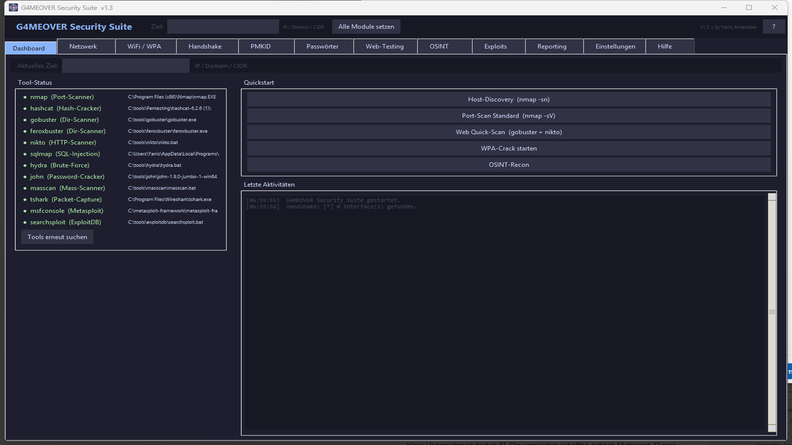 | 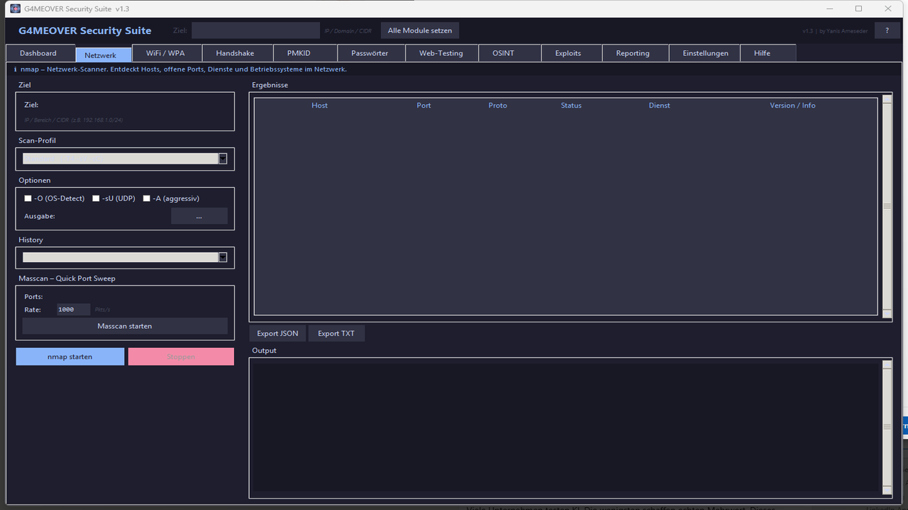 | 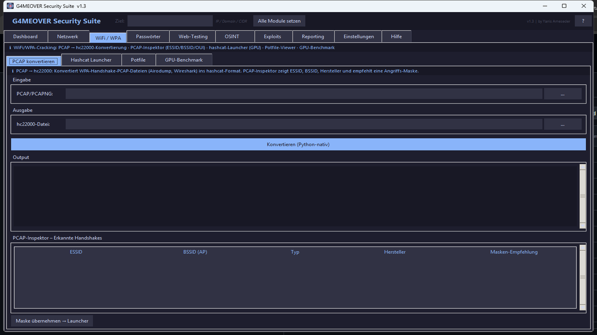 |

| Handshake | PMKID | Passwörter |
|---|---|---|
| 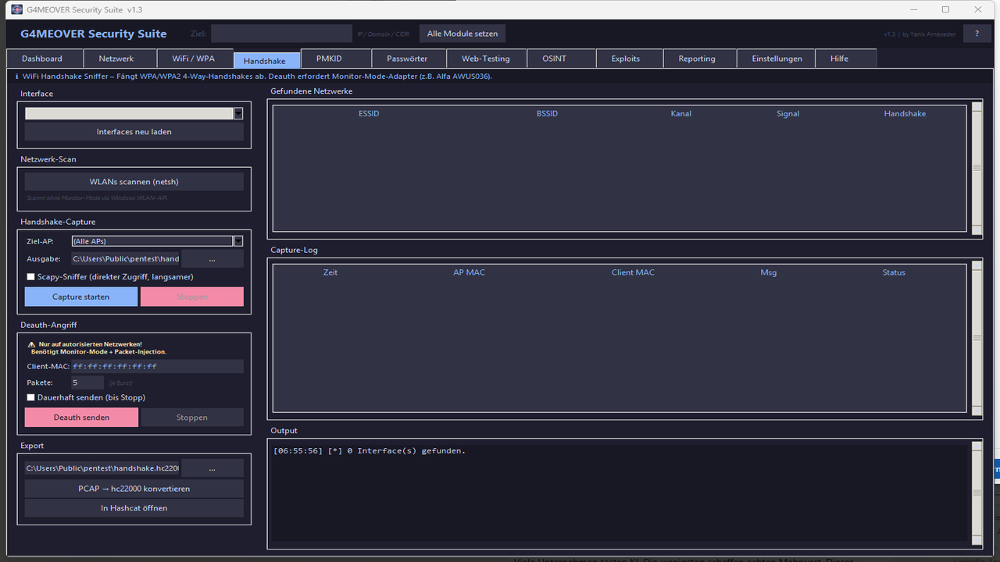 | 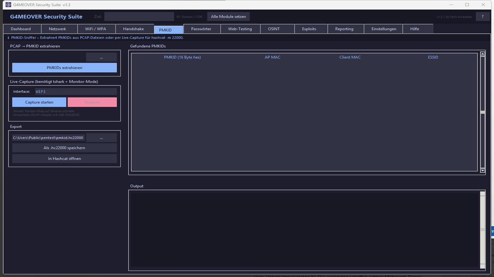 | 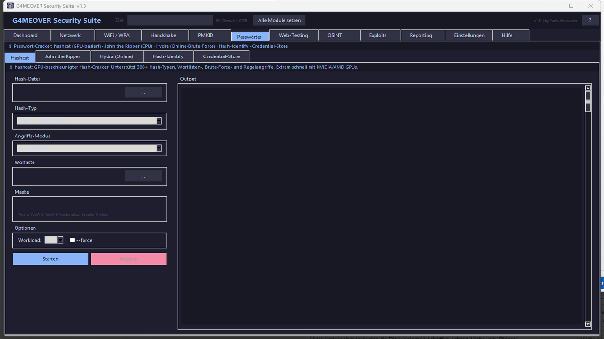 |

| Web-Testing | OSINT | Exploits & CVE |
|---|---|---|
| 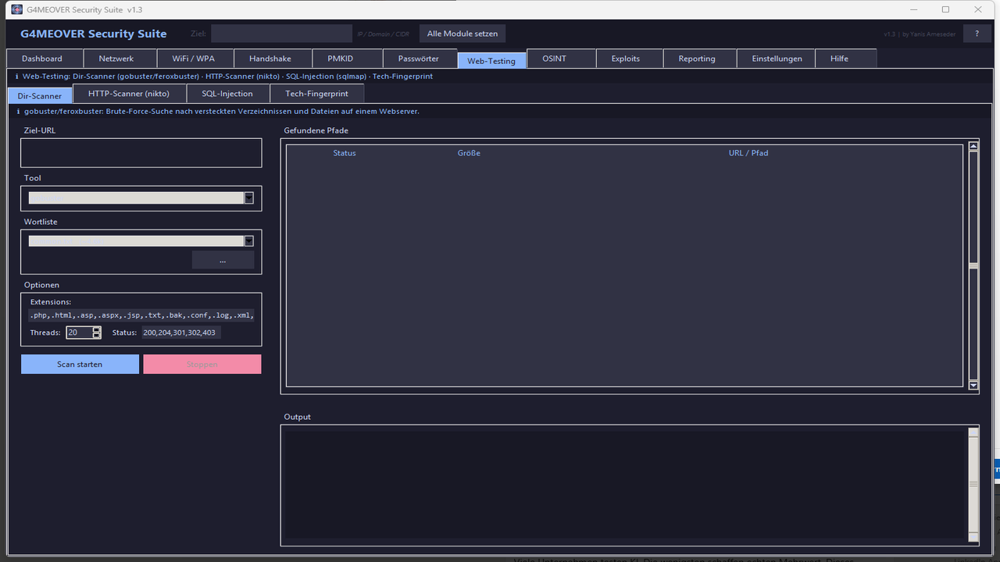 | 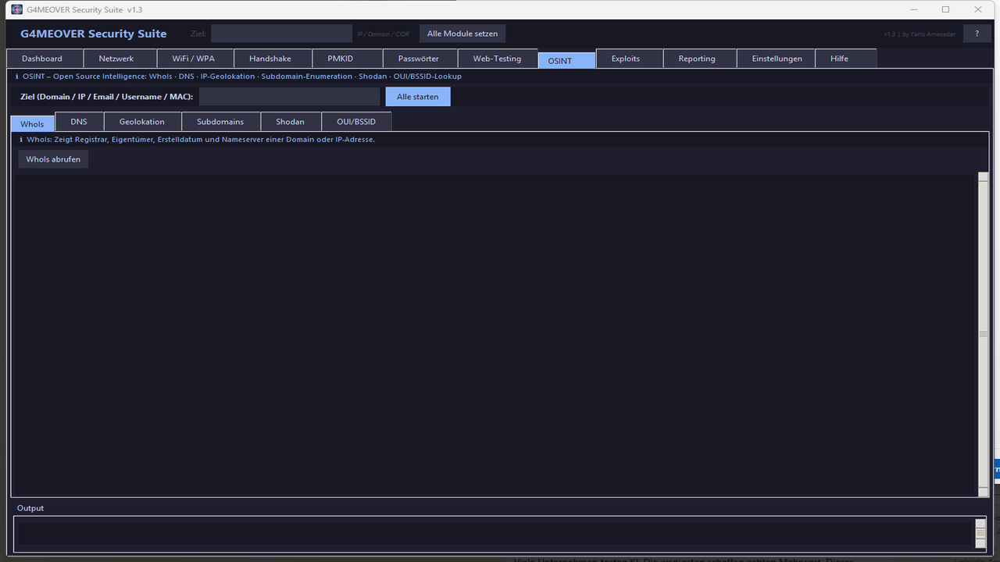 | 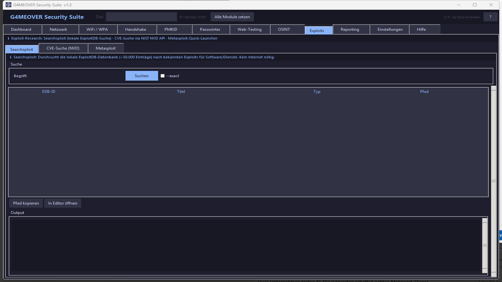 |

| Reporting | Einstellungen | Hilfe |
|---|---|---|
| 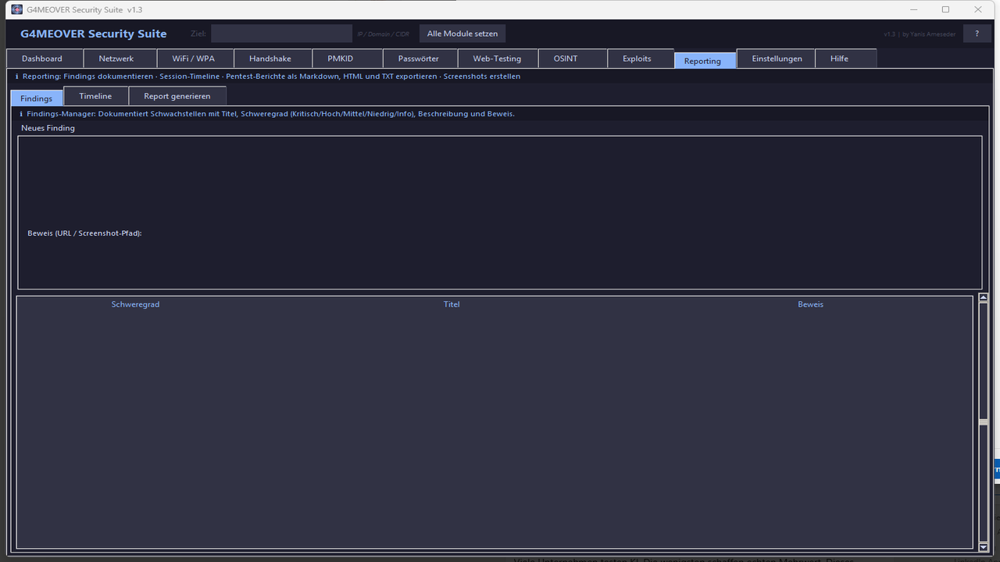 | 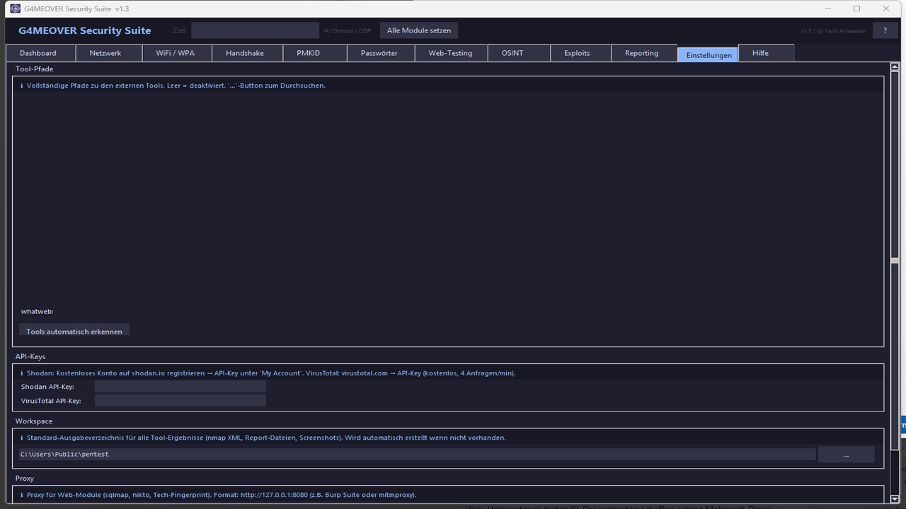 | 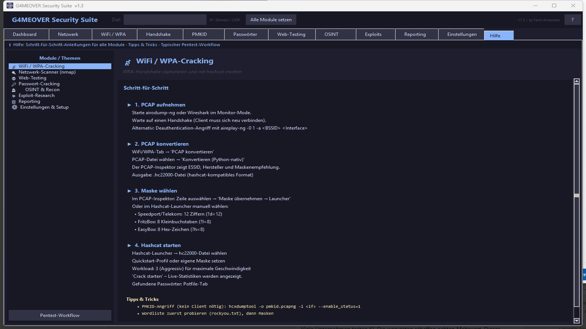 |

---

## Installation

```bash
git clone https://github.com/G4MEOVER18/g4meover-security-suite.git
cd g4meover-security-suite
pip install -r requirements.txt
python openclaw_suite.py
```

Voraussetzung: **Python 3.12** (Windows). `tkinter` ist Teil der Standard­bibliothek; `pillow` und `scapy` werden über `requirements.txt` installiert.

### Empfohlene externe Tools

Die Suite ist ein **Front-End**, das eigenständig installierte Tools orchestriert. Vorhandene Tools werden automatisch erkannt (Dashboard zeigt den Status); fehlende lassen sich in den Einstellungen nachtragen.

| Tool | Download | Funktion |
|------|----------|----------|
| nmap | [nmap.org](https://nmap.org/download.html) | Port-Scanner |
| hashcat | [hashcat.net](https://hashcat.net/hashcat/) | GPU Hash-Cracker |
| gobuster | [GitHub](https://github.com/OJ/gobuster/releases) | Dir-Bruteforce |
| feroxbuster | [GitHub](https://github.com/epi052/feroxbuster/releases) | Rekursiver Dir-Scanner |
| nikto | [GitHub](https://github.com/sullo/nikto) | Web-Scanner |
| sqlmap | [sqlmap.org](https://sqlmap.org/) | SQL-Injection |
| john | [openwall.com](https://www.openwall.com/john/) | Password Cracker |
| tshark | [Wireshark](https://www.wireshark.org/download.html) | Paket-Analyse / Capture |
| metasploit | [metasploit.com](https://www.metasploit.com/download) | Exploit-Framework |

> Python-Alternativen für **hydra**, **masscan** und **whatweb** sind bereits enthalten.

### Handshake-Sniffer & Deauth

Für Monitor-Mode und Packet-Injection wird ein kompatibler WLAN-Adapter benötigt:
- **Alfa AWUS036ACH** (Realtek RTL8812AU) – empfohlen
- **TP-Link TL-WN722N v1** (Atheros AR9271)
- **Panda PAU09** (Ralink RT5572)

Passiver Handshake-Capture funktioniert auch ohne Monitor-Mode, sofern ein Client sich gerade verbindet.

---

## Eigenständige .exe

Für den Einsatz ohne Python-Installation steht eine gebündelte Windows-Anwendung bereit – siehe [Releases](https://github.com/G4MEOVER18/g4meover-security-suite/releases).

Selbst bauen (PyInstaller):

```batch
build_exe.bat
```

Ausgabe: `dist\G4MEOVER_Suite.exe` (kein Konsolenfenster, eigenes Icon, eingebettete Versions-Info).

---

## KI-Integration

```bash
python pentest_api_server.py   # Port 18800
```

| Endpoint | Parameter | Funktion |
|----------|-----------|----------|
| `/searchsploit` | `?query=apache` | ExploitDB durchsuchen |
| `/cve` | `?query=CVE-2021-44228` | NIST CVE-Lookup |
| `/nmap` | `?target=192.168.1.1` | Nmap ausführen |
| `/bssid` | `?mac=AA:BB:CC` | Hersteller-Lookup |

Ollama-kompatible Tool-Definitionen in `ai_core_client.py`.

---

## Konfiguration

```bash
cp suite_config.example.json suite_config.json
# Pfade und API-Keys anpassen
```

`suite_config.json` ist in `.gitignore` – deine Daten bleiben lokal. Eine beschädigte Konfiguration wird beim Start automatisch nach `suite_config.json.corrupt` gesichert, statt verworfen zu werden.

---

## Disclaimer

> Dieses Tool ist **ausschließlich für autorisierte Sicherheitstests, CTF-Challenges und Bildungszwecke** bestimmt. Die Nutzung gegen Systeme ohne ausdrückliche schriftliche Genehmigung ist illegal. Der Entwickler übernimmt keinerlei Haftung für Missbrauch.

---

## Kontakt & Support

**Entwickler:** Yanis Ameseder
**E-Mail:** [g4me.over.18@gmail.com](mailto:g4me.over.18@gmail.com)
**GitHub:** [G4MEOVER18/g4meover-security-suite](https://github.com/G4MEOVER18/g4meover-security-suite)

Fragen, Bug-Reports und Feature-Wünsche gerne per [Issue](https://github.com/G4MEOVER18/g4meover-security-suite/issues) oder E-Mail.

### Projekt unterstützen

Wenn dir dieses Projekt gefällt, freue ich mich über einen Stern auf GitHub oder eine kleine Spende:

<div align="center">

[](https://paypal.me/Freakbank1)

**Bitcoin:** `39vZWmnUwDReQ15BwqQXzyqVQ6U8LardEf`

</div>

---

<div align="center">

**G4MEOVER Security Suite** · © 2025–2026 Yanis Ameseder · MIT-Lizenz

</div>
